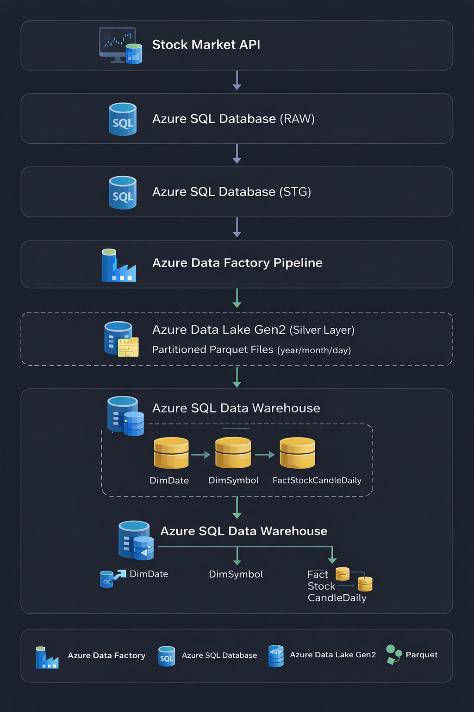

# Azure Data Engineering Stock Pipeline

This project demonstrates an end-to-end Azure Data Engineering pipeline that ingests stock market data, stores it in a partitioned data lake, and loads it into a dimensional data warehouse for analytics.
The architecture follows a modern medallion-style data pipeline:

RAW → STG → Data Lake (Silver) → Data Warehouse (Dim/Fact)

The solution is implemented using Azure Data Factory, Azure SQL Database, and Azure Data Lake Gen2.

# Project Architecture

# Technologies Used
| Technology           | Purpose                                 |
| -------------------- | --------------------------------------- |
| Azure Data Factory   | Data orchestration and transformations  |
| Azure SQL Database   | RAW, STG, and Data Warehouse layers     |
| Azure Data Lake Gen2 | Partitioned storage for analytical data |
| Parquet              | Efficient columnar storage format       |
| Data Flow (ADF)      | Transformations and data enrichment     |
| Star Schema          | Dimensional data modeling               |

# Data Pipeline Overview
# 1. Data Ingestion

Stock market data is ingested into the RAW layer in Azure SQL Database.

	API → Azure SQL (RAW)

The RAW layer preserves the original data with minimal processing.

# 2. Data Cleaning and Validation

Data is transformed and deduplicated in the STG layer.

	RAW → STG

Typical transformations:

duplicate removal

column normalization

data type validation

# 3. Data Lake Storage

Cleaned data is exported to Azure Data Lake Gen2 as partitioned Parquet files.

	STG → ADLS Gen2 (Silver Layer)

Partition structure:

	silver/stock_candle_daily/
    		year=YYYY/
      			  month=MM/
       			     day=DD/

This structure enables efficient query performance.

# 4. Data Warehouse Loading

ADF Data Flows transform the data and load it into a star schema data warehouse.

Silver → Dimensional Model
# Azure Data Factory Components
Piplines

	pl_stg_to_lake_stock
	
	pl_initial_dimsymbol
	
	pl_initial_factstock

Data Flows

	pl_stg_to_lake_stock

	pl_initial_dimsymbol

	pl_initial_factstock
	
Datasets

	AzureSqlTable
	
	AzureSqlDimSymbol
	
	AzureSqlFactStock
	
	Parquet (ADLS)
# Key Features of This Project

✔ End-to-end Azure data pipeline
✔ Data lake partitioning strategy
✔ Dimensional data modeling (Star Schema)
✔ Azure Data Factory orchestration
✔ Data transformation with Data Flow
✔ Git version control integration

